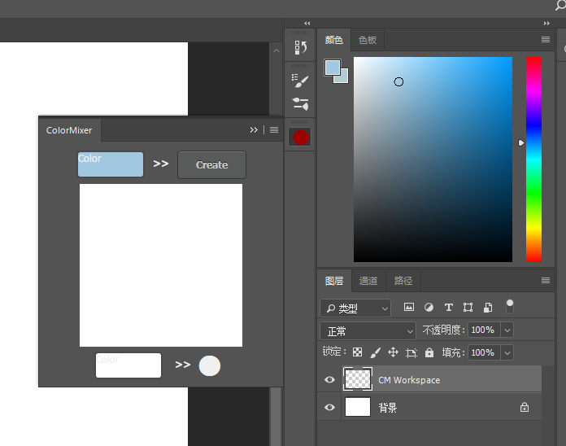
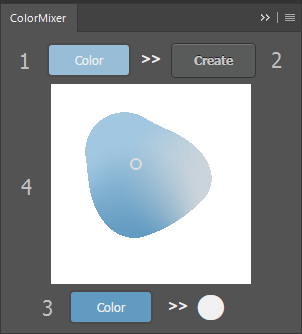
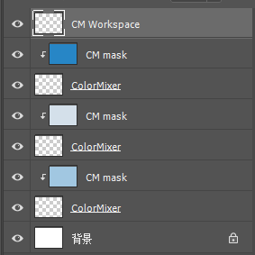

# Document

## Introduction

ColorMixer is an Adobe CEP extension built for software Photoshop. So to use this, a Photoshop should be installed on your computer and any version between CC and CC 2018 should be okay.

## How to start

1. First, the extension should be appropriately set for the PS.

Move the whole file under the path:
- Win(x86): `C:\Program Files\Common Files\Adobe\CEP\extensions`
- Win(x64): `C:\Program Files (x86)\Common Files\Adobe\CEP\extensions`, and `C:\Program Files\Common Files\Adobe\CEP\extensions` (since CEP 6.1)
- Mac: `/Library/Application Support/Adobe/CEP/extensions`

You can refer to the [Adobe CEP document](https://github.com/Adobe-CEP/CEP-Resources/blob/master/CEP_8.x/Documentation/CEP%208.0%20HTML%20Extension%20Cookbook.md#extension-folders) for more information.

2. Open a new document in the Photoshop.

3. Find the ColorMixer and start it. It locates in Windows -  Extension - ColorMixer.

Your interface will look like this:   

## How to use
  

1. The color is interact with the foreground color of the PS. You can change PS's foreground color to change it.
2. Press the button, you will get a blob with the color above.
3. This represents the color of the blob you chose. You can change it through changing the PS's background color. 
4. It's the place showing all the blobs your create. You can change the blob in it or pick a color through it.

For the blobs:
1. Right click to choose a blob. Its color will be shown in the bottom and you can change it by changing PS's background color.
2. Hold the right button and move then you can change the position of the blob.
3. Hold the meddle button and move left/right, you can change its size.
4. Left click, your can chose a color from the palette.

The layers will be organized in the following way:  

Trying to avoid unwanted motivition towards this layers.

**Warning**

1. Whole drawing should be done in the layer "CM Workspace".
2. When using the extension, change of document may cause unwanted trouble.

## Contribution

If you have any problems using the extension or like to contribute for this project, please raise your PR at  https://github.com/Birdy-C/HCI_ColorMixer.

Copyright (c) 2018 Birdy
